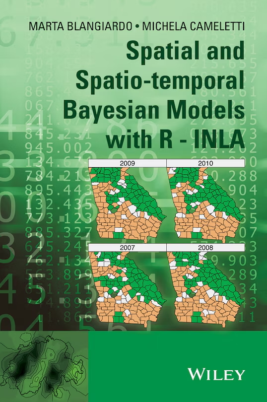

# Spatial and Spatio-temporal Bayesian Models with R-INLA
Textbook Summary and reworked proofs for the textbook:
**_Spatial and Spatio-temporal Bayesian Models with R - INLA_**

Spatial and Spatio-Temporal Bayesian Models with R-INLA provides a much-needed, practically oriented and innovative presentation combining Bayesian methodology and spatial statistics. 

The authors formulate an introduction to Bayesian theory and methodology with a focus on the spatial and spatio-temporal models used within the Bayesian framework and a series of practical examples which allow the reader to link the statistical theory presented to real data problems. 

The numerous examples from the fields of epidemiology, biostatistics and social science all are coded in the R package R-INLA, which has proven to be a valid alternative to the commonly used Markov Chain Monte Carlo simulations

**Publisher: Wiley
ISBN: 9781118326558**

[Chapter 1 to 3 Spatio-Temporal Models.pdf](Chapters/Chapter%201%20to%203%20Spatio-Temporal%20Models.pdf)

[Chapter 4 Bayesian Computing.pdf](Chapters/Chapter%204%20Bayesian%20Computing.pdf)

[Chapter 5 Bayesian Computing copy.pdf](Chapters/Chapter%204%20Bayesian%20Computing.pdf)

[Chapter 6 Advanced Models.pdf](Chapters/Chapter%206%20Advanced%20Models.pdf)

[chapter 7 Spatio-Temporal Models.pdf](Chapters/Chapter%207%20Spatio-Temporal%20Models.pdf)

[Chapter 8 Advanced Models.pdf](Chapters/Chapter%208%20Advanced%20Models.pdf)

